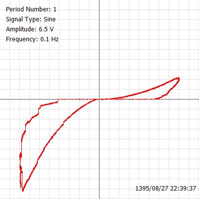
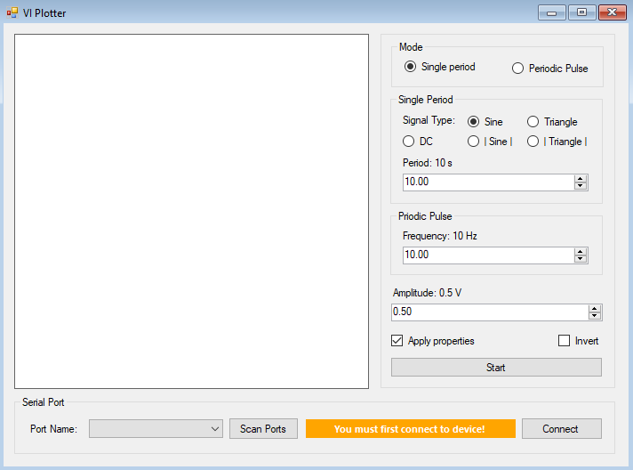
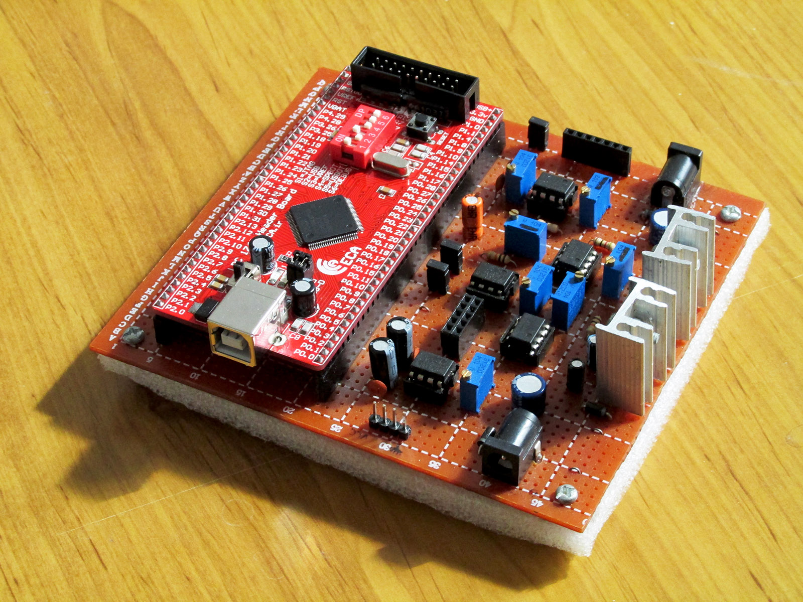

# V-I Diagram Plotter using SerialPort in C#

This application was used for a research on a memristive device which was published in this paper in 2016:

[Practical method to make a discrete memristor based on the aqueous solution of copper sulfate](https://link.springer.com/article/10.1007%2Fs00339-016-0132-6)

The projects consists of three sections:

- Dektop application written in Visual Studio in C#

- Electronics board for precise transformations of analog voltages and currents

- Embedded program written for getting commands from UART (serial port) and generating a voltage using DAC and reading the resulting current using ADC
